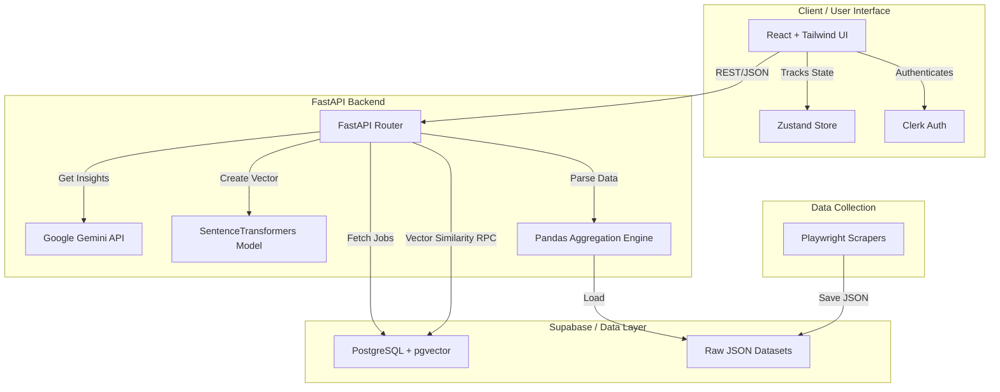

# CareerSathi 2.0 - AI-Powered Career Ecosystem

An intelligent, data-driven career alignment platform that leverages Large Language Models (LLMs) and advanced Vector Search (RAG) to bridge the gap between job seekers and their ideal roles. CareerSathi provides hyper-personalized job recommendations, real-time market analytics, and deep-dive opportunity analysis.


## 🌟 Key Features

1. **AI Job Alignment Engine (RAG Pipeline)**
   - Uses `SentenceTransformers` (`all-MiniLM-L6-v2`) to create high-dimensional vector embeddings of user profiles (skills, experience, bio) and job descriptions.
   - Performs blazing-fast Cosine Similarity searches using **pgvector** inside Supabase to find semantically matching jobs.
   - Applies strict heuristic filters to ensure seniority and experience alignment (preventing junior candidates from seeing senior roles).

2. **Opportunity Analyzer (Custom JD Evaluation)**
   - Allows users to paste any external job description into the platform.
   - Uses **Google Gemini 1.5 Flash** to perform a hyper-critical, recruiter-level evaluation of the user's profile against the custom job.
   - Generates a 5-Section Coaching Report: Match Justification, Core Strengths, Critical Missing Skills / Gaps, Growth Roadmap, and Application Strategy.

3. **Live Market Analytics Dashboard**
   - Ingests tens of thousands of scraped jobs from top platforms (Wellfound, Internshala, Indeed, Naukri).
   - Aggregates salary distributions, job types, top geographical locations, and the most in-demand tech stacks.
   - Beautiful, interactive data visualizations built with `Recharts`.

4. **Automated Data Scraping Pipeline**
   - Python-based web scrapers utilizing Playwright and BeautifulSoup to extract and structure live market data seamlessly.

---

## 🏗️ Technical Architecture & Diagram

CareerSathi operates on a decoupled Client-Server architecture with a unified database layer.



---

## 🛠️ Tech Stack

### Frontend
- **Framework Framework**: React 18 (Vite)
- **Styling**: TailwindCSS, Headless UI, Framer Motion
- **State Management**: Zustand
- **Data Visualization**: Recharts
- **Authentication**: Clerk

### Backend
- **Web Framework**: FastAPI (Python 3.10+)
- **AI & NLP**: Google GenAI (`gemini-1.5-flash`), `sentence-transformers`
- **Data Processing**: Pandas, NumPy
- **Server Environment**: Docker, Uvicorn

### Database & Infrastructure
- **Database**: Supabase (PostgreSQL)
- **Vector Search**: pgvector extension (ivfflat indexing)
- **Containerization**: Docker & Docker Compose

---

## 🚀 Getting Started

Follow these instructions to get a local copy of the project up and running.

### Prerequisites
- Docker and Docker Compose
- Node.js (v18+)
- Python 3.10+
- A [Supabase](https://supabase.com/) Account & Project
- A Google Gemini API Key

### 1. Clone the repository
```bash
git clone https://github.com/your-username/CareerSathi-2.0.git
cd CareerSathi-2.0
```

### 2. Environment Variables Integration
You will need to set up two `.env` files.

**Backend (`backend/.env`):**
```env
SUPABASE_URL=your_supabase_project_url
SUPABASE_KEY=your_supabase_anon_or_service_key
GEMINI_API_KEY=your_google_gemini_api_key
```

**Frontend (`frontend/.env`):**
```env
VITE_CLERK_PUBLISHABLE_KEY=your_clerk_publishable_key
VITE_SUPABASE_URL=your_supabase_project_url
VITE_SUPABASE_ANON_KEY=your_supabase_anon_key
VITE_API_BASE_URL=http://localhost:8000/api
```

### 3. Database Setup (Supabase)
Navigate to your Supabase SQL Editor and execute the schema provided in `backend/supabase_fix.sql`. This will:
- Enable the `vector` extension.
- Create all core tables (`users`, `jobs`, `user_embeddings`, `job_matches`, `insights_cache`).
- Deploy the highly-optimized `match_jobs` RPC function for Cosine Similarity calculations.

### 4. Running the Application (Dockerized)
The easiest way to run the entire backend stack is via Docker.

```bash
# Build and start the backend containers
docker-compose up --build -d
```
*The backend API will be available at `http://localhost:8000`.*

### 5. Running the Frontend
Navigate to the frontend directory and start the Vite development server.

```bash
cd frontend
npm install
npm run dev
```
*The client app will be accessible at `http://localhost:5173`.*

---

## 🧠 Core Systems Deep Dive

### The RAG Pipeline (`rag_pipeline.py`)
1. Fetches the user's saved profile from Supabase.
2. Converts the profile text into a 384-dimensional dense vector using `all-MiniLM-L6-v2`.
3. Calls the Supabase RPC function `match_jobs` to execute mathematical `Cosine Similarity` against tens of thousands of jobs mathematically instantly.
4. Drops out jobs explicitly asking for advanced seniority if the user is a junior candidate.
5. Feeds the top 10 remaining semantic matches to Gemini to generate personalized gap analysis and suggestions.

### Opportunity Analyzer (`analyze.py`)
Bypasses the vector search entirely. Feeds the candidate's profile along with 100% of a user-pasted Job Description into Gemini. We specifically structured the LLM Prompt Schema to forcefully extract harsh truths, preventing AI hallucinations and strictly identifying missing technical skills.

---

## 📝 License
Distributed under the MIT License. See `LICENSE` for more information.

## 🤝 Contact
Designed and Built by [Your Name / Team] for bridging the gap between talent and opportunity.
